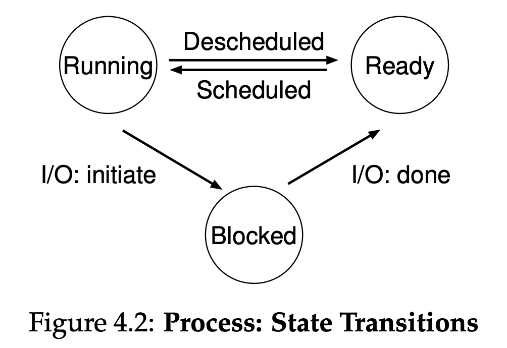
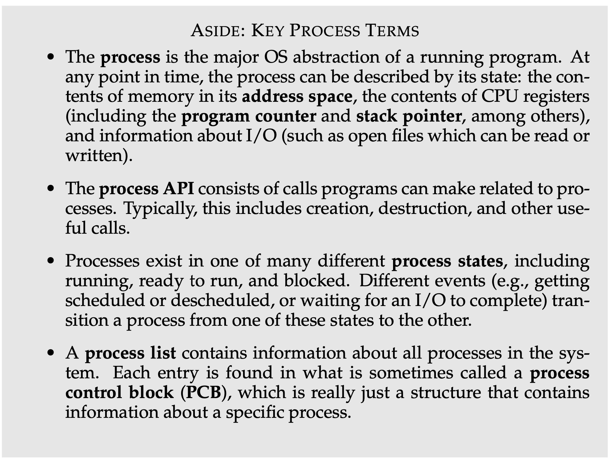

# ch4 The Abstraction: The Process - note

搭配以下面試題做筆記
- process vs. thread
- video: https://youtu.be/4rLW7zg21gI
## note
- process
  - 哪些東西構成一個 process ？
  - "each process has its own address space"
    - data 與 Instructions 都在 memory 中等待 cpu 執行
  - registers
    - "the program counter (PC) (sometimes called the instruction pointer or IP) tells us which instruction of the pro- gram will execute next;"
    - top of the "Memory hierarchy"
    - in the cpu
  - allocate run-time stack
    - "C programs use the stack for local variables, function parameters, and return addresses"
      - csapp 3.7.1 the run-time stack
    - "the heap is used for explicitly requested dynamically-allocated data"
      - csapp 9.9 Dynamic Memory Allocation 875
  - heap 
- content switch 

- 4.1 The Abstraction: A Process
  - process 是一個 running program
  - a virtualized of cpu
  - **content switch** between processes
    - low level, 這是一種 machanism
  - scheduling policy 決定要執行哪個 program
    - policy 是 high level 的 intelligence
  - 要了解 process 要先知道他的 "machine state"
- 4.2 Process API
- 4.3 一個 program 是如何變成正在執行的 process 的？
  - some initial work to be done.
- 4.4 Process States
  - 3 state: running, ready, blocked
    - 
  - blocked 正在進行一些需要等待的 operation，例如 I/O
    - "Blocked: In the blocked state, a process has performed some kind of operation that makes it not ready to run until some other event takes place. A common example: when a process initiates an I/O request to a disk, it becomes blocked and thus some other process can use the processor."
- 4.5 Data structure
  - process list 是一種最簡單的例子。列出 process 可以被記錄的 state 種類。
  - Process Control Block (PCB)
    - "Sometimes people refer to the individual struc- ture that stores information about a process as a Process Control Block (PCB), a fancy way of talking about a C structure that contains informa- tion about each process (also sometimes called a process descriptor)."
    - https://www.baeldung.com/linux/pcb
- Just remember these import terms and concept!
  - 