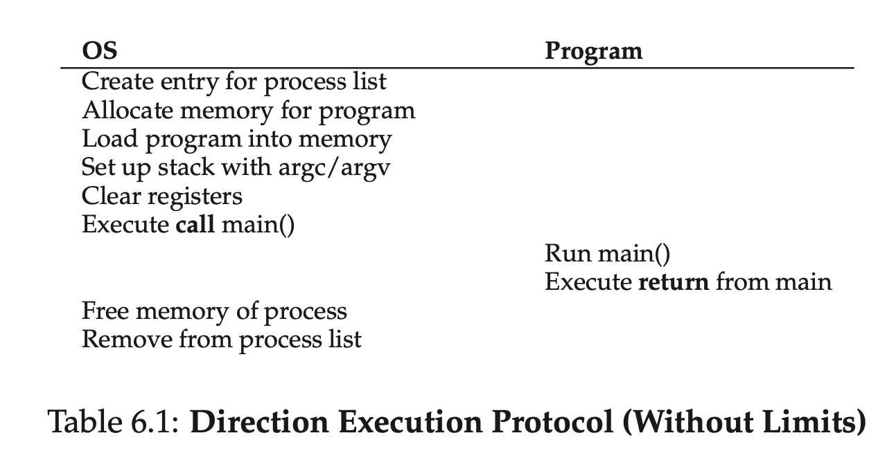
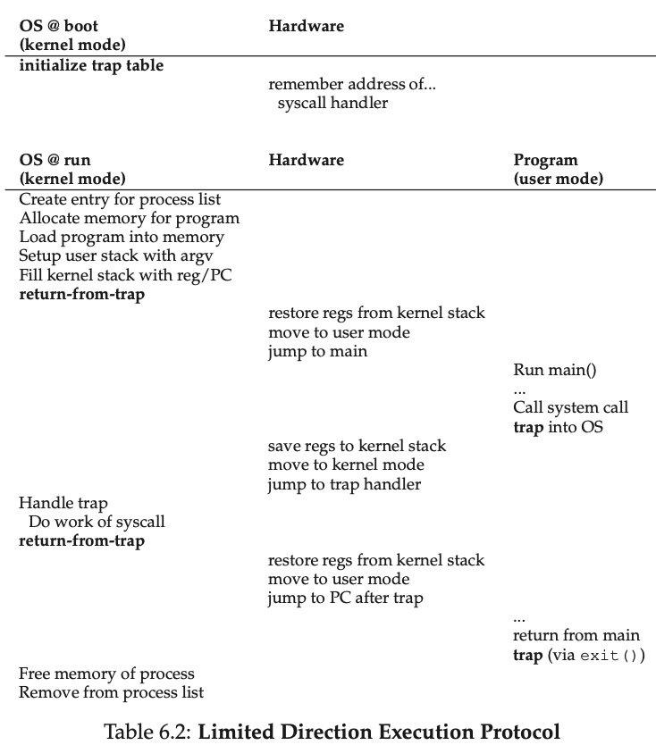

# Mechanism: Limited Direct Execution

- THE CRUX:
  - HOW TO EFFICIENTLY VIRTUALIZE THE CPU WITH CONTROL
  - The OS must virtualize the CPU in an efficient manner, but while re- taining control over the system. To do so, both hardware and operating systems support will be required. The OS will often use a judicious bit of hardware support in order to accomplish its work effectively.

## Basic Technique: Limited Direct Execution
- 
  - 首先用這張圖說明 Limited Direct Execution 中的 "Direct Execution" 如何運作。
  - OS 透過這樣的流程，把一支 program 運行所需的資源準備好，使 cpu 可以來執行

## Problem #1: Restricted Operations
- THE CRUX: HOW TO PERFORM RESTRICTED OPERATIONS
  - A process must be able to perform I/O and some other restricted oper- ations, but without giving the process complete control over the system. How can the OS and hardware work together to do so?
  - 在 OS 如何在有限制的狀況下，讓 process 進行 I/O 和其他對硬體的操作？
- 不能讓 process 有所有的權限，不然會很危險。例如任何 user process 都有權限刪除硬碟中所有資料。
- 因此區分 user mode vs. kernel mode
  - "The hardware assists the OS by providing different modes of execution. In user mode, applications do not have full access to hardware resources. In kernel mode, the OS has access to the full resources of the machine. Special instructions to trap into the kernel and return-from-trap back to user-mode programs are also provided, as well instructions that allow the OS to tell the hardware where the trap table resides in memory."
- user mode
  - 不能 issue I/O
    - [POSIX](https://en.wikipedia.org/wiki/POSIX) 就有提供一系列的 system call api，可用與硬體溝通等。
- kernel model
  - 通常 os 本身或 kernel 是使用這個 mode 執行
  - 能過進行一些需要權限的操做
  - 能夠 access 所有 hardware resources
- Q: 那這樣 user 的程式是如何與 file disk 進行 read/write? (system call)
  - A: 透過 system call，可以讓 user program 在比較受限制的狀況下，使用 kernel 的功能。例如 access file system，建立或中斷 process，分配更多的記憶體等等。
  - trap instruction: 進入 kernel mode，執行 calling process 需要的 privileged operations
  - return-from-trap instruction: 回到 user mode，繼續執行 calling process，同時降低 privilege level，回到 user mode。
- "On x86, for example, the processor will push the program counter, flags, and a few other registers onto a per-process kernel stack; the return-from-trap will pop these values off the stack and resume exe- cution of the user-mode program"
  - 這是指 x86 系統，從  executing a trap 之後，會儲存目前 process 的 state，例如 "program counter, flags, and a few other registers"，把這些東西 push 到 kernel stack。
  - 當 return-from-trap 後，會把這些值 pop 出來，並繼續執行 user-mode program。
  - [ ] what is kernel stack?
  - [ ] how does the program counter operate?
    - 有點像是一個計數器 + 指針，告訴 processor 下一個要執行的 instruction 在哪裡。
    - 當一條指令被執行後，Program Counter 通常會自動增加，以指向下一條指令的地址。這個增加的數值通常是當前指令的長度。
    - 有些指令，如跳轉或分支指令，會改變 Program Counter 的值，使其指向一個新的地址。這允許程序的執行流程可以非線性地移動。
    - 當發生中斷或異常（trap）時，當前的 Program Counter 值會被保存下來，以便在中斷處理完畢後能夠恢復到當前的執行位置。
- 要如何知道當 trap 發生的時候，要執行哪些 kernel 的功能？
  - trap table
    - 開機時就會 set up trap table
    - trap table 會紀錄當這類型的 exceptional events 出現的時候，硬體應該要執行哪些 code 對應
      - 例如：hard-disk interrupt 怎麼做、keyboard interrupt 怎麼做
      - trap handlers
- 
  - OS boot 之前
    - 準備好 trap table
    - cpu 會知道 trap table 的位置，當需要 trap handler 時，會去找 trap table
  - OS boot 之後運行時
    - kernel set up 且使用 return-from-trap instruction，切換 cpu 至 user mode
    - 當 issue system call 時，會 trap into OS 切換為 kernel mode，執行 trap handler
    - 當 trap handler 執行完畢，會 return-from-trap 切換回 user mode，繼續執行 user program
    - 程式完成時，會從 `main()` return。此時程式會自動調用 `exit()` system call 來結束程式，並釋放所有資源。

## Problem #2: Switching Between Processes
- THE CRUX: HOW TO REGAIN CONTROL OF THE CPU
  - How can the operating system regain control of the CPU so tha t it can switch between processes?
### A Cooperative Approach: Wait For System Calls
  - 等待 process 呼叫 system call，OS 才拿到控制權
  - 這種方式不太好。試想 infinite loop。
### A Non-Cooperative Approach: The OS Takes Control
- 所以這迎來了第二個問題：當今天 process 有問題的時候，OS 如何拿回控制權？
  - THE CRUX: HOW TO GAIN CONTROL WITHOUT COOPERATION 
    - How can the OS gain control of the CPU even if processes are not being cooperative? What can the OS do to ensure a rogue process does not take over the machine?
- timer interrupt
- context switch
  - "save a few register values for the currently-executing process (onto its kernel stack, for example) and restore a few for the soon-to-be-executing process (from its kernel stack)."
  - save register of current process, and restore register of soon-to-be-executing process
## 相關面試題
Q: user mode、kernel mode 的差別？簡單解釋 system call 流程？trap 是什麼？。
- user mode: 在此 mode 的 process 無法直接 access hardware resources，也無法進行需要權限的操作(privileged operations)。
- kernel model: 對整個系統與硬體資源都有權限存取，能夠進行需要權限的操作 (privileged operations)。
  - 例如分配記憶體、I/O。
- system call
  - 但是 user mode 的 process 總是有需要進行 privileged operations 的需求，例如 I/O。這時候就會透過 system call，來進行需要進到 kernel mode 的操作。因此這時候就會使用 system call 來達成。
  - trap 是一種中斷，在需要進行 system call 時，會由 process 產生，並通知 OS 需要進入 kernel mode。
  - process 會透過 "trap instruction" 進入 kernel mode，此時 OS 會保存這個 process 的 state。例如 program counter, registers 等。接著執行 calling process 需要的 privileged operations。
  - 完成 "privileged operations" 後，會透過 "return-from-trap instruction" 回到 user mode，繼續執行 calling process，同時降低 privilege level，回到 user mode。